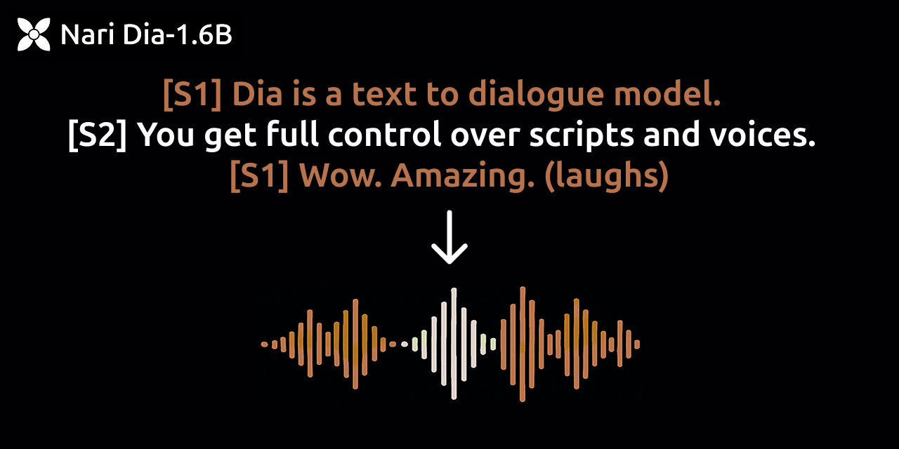

<p align="center">
<a href="https://github.com/nari-labs/dia">

</a>
</p>
<p align="center">
<a href="https://tally.so/r/meokbo" target="_blank"></a>
<a href="https://discord.gg/pgdB5YRe" target="_blank"></a>
<a href="https://github.com/nari-labs/dia/blob/main/LICENSE" target="_blank"></a>
</p>
<p align="center">
<a href="https://huggingface.co/nari-labs/Dia-1.6B"></a>
<a href="https://huggingface.co/spaces/nari-labs/Dia-1.6B"></a>
</p>

Dia is a 1.6B parameter text to speech model created by Nari Labs, known for generating state-of-the-art, highly realistic dialogue.

Dia **directly generates dialogue from a transcript**, allowing conditioning on audio for emotion/tone control and producing non-verbal sounds like laughter. The base model excels in naturalness and prosody but produces a random voice identity on each run unless prompted or seeded.

This repository provides pretrained checkpoints ([Hugging Face](https://huggingface.co/nari-labs/Dia-1.6B)) and code for inference, pruning, and fine-tuning (including LoRA for speaker adaptation) to enable controlled voice output and deployment on resource-constrained devices. The model currently supports English only.

- **Demo:** Compare Dia to other models [here](https://yummy-fir-7a4.notion.site/dia).
- **Live Demo:** Try the ZeroGPU Space on [Hugging Face](https://huggingface.co/spaces/nari-labs/Dia-1.6B).
- **Community:** Join our [Discord server](https://discord.gg/pgdB5YRe).
- **Early Access:** Join the [waitlist](https://tally.so/r/meokbo) for larger versions.

## ⚡️ Quickstart

### Install via pip

```bash
# Install directly from GitHub
pip install git+https://github.com/nari-labs/dia.git

# For LoRA fine-tuning or adapter inference, also install peft:
# pip install peft>=0.8.0
```

### Run the Gradio UI

This provides a web interface for generation and voice cloning.

```bash
git clone https://github.com/nari-labs/dia.git
cd dia

# Using uv (recommended)
uv venv # Create virtual environment
source .venv/bin/activate
uv pip install -e ".[dev]" # Install editable with dev dependencies (includes peft)
python app.py

# Using pip/venv
# python -m venv .venv
# source .venv/bin/activate
# pip install -e ".[dev]"
# python app.py
```

The Gradio app uses the base model by default. See [Using Pruned/Fine-tuned Models](#-using-prunedfine-tuned-models) for how to run the UI with modified models.

## Features

-   **High-Quality Dialogue:** Generate speech with natural prosody via `[S1]` and `[S2]` tags.
-   **Non-Verbal Sounds:** Generate sounds like `(laughs)`, `(sighs)`, etc. (see [supported list](#supported-non-verbal-tags)).
-   **Voice Cloning (Zero-Shot):** Condition generation on a 5-10 second audio prompt to mimic its voice (see [Usage](#️-usage) and [Caveats](#-caveats--best-practices)).
-   **Model Pruning:** Reduce model size significantly using structured or unstructured pruning for efficient deployment (see [Pruning](#️-pruning)).
-   **Fine-tuning & Speaker Adaptation:**
    -   **Full Fine-tuning:** Adapt the entire model (base or pruned) to a specific style or domain.
    *   **LoRA (Low-Rank Adaptation):** Efficiently adapt the model (base or pruned) to target speaker voices using minimal data (~3 minutes) (see [Fine-tuning & Speaker Adaptation](#-fine-tuning--speaker-adaptation)).

### Supported Non-Verbal Tags

Using tags from this list is recommended. Others might produce unexpected results.
`(laughs), (clears throat), (sighs), (gasps), (coughs), (singing), (sings), (mumbles), (beep), (groans), (sniffs), (claps), (screams), (inhales), (exhales), (applause), (burps), (humming), (sneezes), (chuckle), (whistles)`

## ⚙️ Usage

### As a Python Library

```python
from dia.model import Dia
from pathlib import Path

# --- 1. Load the Base Model ---
# Use float16/bfloat16 on GPU, float32 on CPU
model = Dia.from_pretrained("nari-labs/Dia-1.6B", compute_dtype="float16")
print(f"Base model loaded on: {model.device}")

# --- 2. Basic Generation ---
# Follow dialogue format guidelines (start S1, alternate, end with previous tag)
text = "[S1] This is a basic dialogue example. [S2] It uses alternating speaker tags. [S1]"
output_basic = model.generate(text, seed=42, verbose=True)
if output_basic is not None:
    model.save_audio("basic_output.wav", output_basic)

# --- 3. Voice Cloning (Zero-Shot) ---
# Provide a 5-10 second audio file and its exact transcript
clone_audio_path = "path/to/your_speaker_audio.wav" # Replace with your file
clone_transcript = "[S1] This is the exact text spoken in the audio file above. [S1]" # Match speaker tags too
text_to_generate = "[S1] Generate this text using the voice from the audio prompt. [S2] It should sound similar! [S1]"

if Path(clone_audio_path).exists():
    # Combine prompt transcript and generation text
    full_text_for_clone = clone_transcript + " " + text_to_generate
    output_cloned = model.generate(
        text=full_text_for_clone,
        audio_prompt=clone_audio_path,
        audio_prompt_text=clone_transcript, # Required by generate function
        seed=123,
        verbose=True
    )
    if output_cloned is not None:
        model.save_audio("cloned_output.wav", output_cloned)
else:
    print(f"Audio prompt file not found: {clone_audio_path}")

# --- 4. Using a Pruned Model (See Pruning section for how to create) ---
# Pruning is done offline. Load the saved pruned model artifacts.
pruned_model_dir = "./pruned_dia_60_unstructured" # Example path
config_path = Path(pruned_model_dir) / "config.json"
checkpoint_path = Path(pruned_model_dir) / "pytorch_model.bin"

if config_path.exists() and checkpoint_path.exists():
    print(f"Loading pruned model from: {pruned_model_dir}")
    pruned_model = Dia.from_local(
        config_path=str(config_path),
        checkpoint_path=str(checkpoint_path),
        compute_dtype="float16" # Or float32 for CPU
    )
    output_pruned = pruned_model.generate(text, seed=43, verbose=True)
    if output_pruned is not None:
        pruned_model.save_audio("pruned_output.wav", output_pruned)
else:
    print(f"Pruned model files not found in {pruned_model_dir}")


# --- 5. Using a LoRA Adapter (See Fine-tuning section for how to create) ---
# Requires 'peft' library: pip install peft
# Load the BASE model first, then apply the adapter.
try:
    from peft import PeftModel
    PEFT_AVAILABLE = True
except ImportError:
    PEFT_AVAILABLE = False
    print("PEFT library not installed, cannot load LoRA adapter.")

lora_adapter_dir = "./finetuned_lora_speakerX/final_model" # Example path

if PEFT_AVAILABLE and Path(lora_adapter_dir).exists():
    print("Loading base model for LoRA...")
    # Load base model (can be the original or a pruned base)
    base_model_for_lora = Dia.from_pretrained("nari-labs/Dia-1.6B", compute_dtype="float16")
    # base_model_for_lora = Dia.from_local(config_path, checkpoint_path) # Or load pruned base

    print(f"Loading LoRA adapter from: {lora_adapter_dir}")
    # Apply the adapter to the underlying nn.Module
    base_model_for_lora.model = PeftModel.from_pretrained(
        base_model_for_lora.model, # Pass the nn.Module
        lora_adapter_dir
    )
    base_model_for_lora.model.eval() # Ensure adapter is in eval mode

    print("Generating with LoRA adapter...")
    output_lora = base_model_for_lora.generate(text, seed=44, verbose=True)
    if output_lora is not None:
        base_model_for_lora.save_audio("lora_output.wav", output_lora)
elif PEFT_AVAILABLE:
    print(f"LoRA adapter directory not found: {lora_adapter_dir}")

```

### Command Line Interface (CLI)

Generate audio, perform voice cloning, or use pruned/adapted models via CLI.

```bash
# Basic generation
python cli.py \
    "[S1] Generating audio from the command line. [S2] This is quite convenient. [S1]" \
    --output cli_basic.wav \
    --model-path nari-labs/Dia-1.6B \
    --device cuda # Or cpu, mps

# Voice cloning
python cli.py \
    "[S1] Generate this using the voice prompt. [S1]" \
    --output cli_cloned.wav \
    --model-path nari-labs/Dia-1.6B \
    --audio-prompt path/to/your_prompt.wav \
    --audio-prompt-text "[S1] Transcript of your prompt audio. [S1]" \
    --device cuda

# Using a pruned model
python cli.py \
    "[S1] Testing the pruned model performance. [S1]" \
    --output cli_pruned.wav \
    --model-path ./pruned_dia_60_unstructured \
    # --config ./pruned_dia_60_unstructured/config.json # Optional if config is in model-path dir
    # --pruned-checkpoint ./pruned_dia_60_unstructured/pytorch_model.bin # Optional if bin is in model-path dir
    --device cpu # Often used for pruned models

# Using a LoRA adapter (requires peft installed)
python cli.py \
    "[S1] Generating audio with a specific speaker voice via LoRA. [S1]" \
    --output cli_lora.wav \
    --model-path nari-labs/Dia-1.6B \
    --adapter-path ./finetuned_lora_speakerX/final_model \
    --device cuda
```

Run `python cli.py --help` for all available options.

## 💻 Hardware and Inference Speed

-   **GPU:** Recommended for best performance (PyTorch 2.1+, CUDA 11.8+). `float16` or `bfloat16` precision offers significant speedups. See benchmarks below. `torch.compile` can further accelerate inference on compatible hardware.
-   **CPU:** Possible, especially with pruned models, but significantly slower. Use `compute_dtype="float32"`. The Gradio app includes optional dynamic quantization (`--quantize-cpu`) for potential CPU speedup. Expect slower-than-realtime performance.
-   **Initial Run:** The first execution downloads the Descript Audio Codec (DAC) model (~500MB), which may take time.

**GPU Benchmarks (RTX 4090, `use_torch_compile=True`):**

| precision  | realtime factor | VRAM  |
| :--------- | :-------------- | :---- |
| `bfloat16` | ~x2.1           | ~10GB |
| `float16`  | ~x2.2           | ~10GB |
| `float32`  | ~x1.0           | ~13GB |

*(Realtime factor > 1 means faster than realtime)*

**CPU Usage & Batch Sizes:**

-   **Inference:** Use batch size 1. Pruning is key for CPU feasibility.
-   **Fine-tuning (CPU):** Use batch size 1. Training will be extremely slow.
-   **Fine-tuning (GPU - A6000 48GB Example):**
    -   Full FT: Batch size ~4-8 (`float16`)
    -   LoRA FT: Batch size ~16-32+ (`float16`)

## ✂️ Pruning

Pruning reduces model size by removing weights deemed less important. This is an **offline process**: you prune the model once, save the result, and then use the smaller model for inference or further fine-tuning.

**Goal:** Reduce model size (e.g., for CPU deployment) while minimizing impact on the core speech quality.

**Recommended Workflow (Iterative Pruning & Stabilization):**

This approach aims to preserve the high quality of the base Dia model better than a single large pruning step.

1.  **(Optional) Generate Stabilization Dataset:** Create a small dataset (~500-1000 samples) using the *original, unpruned* Dia model with `generate_finetune_data.py`. This dataset represents the target quality we want the pruned model to retain.
    ```bash
    python generate_finetune_data.py --output-dir ./dia_general_dataset --num-samples 500
    ```
2.  **Load Base Model:** Start with the original `nari-labs/Dia-1.6B`.
3.  **Iterate Pruning & Fine-tuning:**
    *   **Prune Incrementally:** Apply a small amount of *unstructured* pruning (generally safer for quality).
        ```python
        # Inside a script like prune_and_stabilize.py
        from dia.pruning_utils import apply_unstructured_pruning
        apply_unstructured_pruning(model.model, amount=0.2) # Prune 20%
        ```
    *   **Stabilize via Fine-tuning:** Fine-tune the *entire pruned model* (no LoRA yet) for a very short duration (e.g., 1 epoch or even fewer steps) on the *stabilization dataset*. This helps the network adjust to the removed weights.
        ```bash
        # Use finetune.py in full mode
        python finetune.py \
            --model-path ./path_to_current_pruned_model \
            --dataset-dir ./dia_general_dataset \
            --output-dir ./temp_stabilized_model_20pct \
            --adapter-mode none \
            --epochs 1 \
            --learning-rate 1e-5 \
            --batch-size 4 \
            --save-steps 99999 # Don't save intermediate checkpoints here
        # Update model path for next iteration
        ```
    *   **Repeat:** Prune further (e.g., target 40%, 60%) and repeat the short stabilization fine-tuning step. Evaluate general speech quality periodically.
4.  **Make Pruning Permanent:** Once the target sparsity is reached and quality is acceptable:
    ```python
    from dia.pruning_utils import make_pruning_permanent
    make_pruning_permanent(model.model)
    ```
5.  **Save the Pruned Base Model:** Save the final `state_dict` and `config.json`. This pruned model is now ready for speaker adaptation via LoRA or direct use.

**Example Pruning Script Snippet (Conceptual):**

```python
# prune_script.py (Illustrative)
import torch
from dia.model import Dia
from dia.pruning_utils import apply_unstructured_pruning, make_pruning_permanent, check_pruning_sparsity
from pathlib import Path
import subprocess # To call finetune.py

MODEL_ID = "nari-labs/Dia-1.6B"
STABILIZATION_DATASET = "./dia_general_dataset" # Assumes generated
TARGET_SPARSITY = 0.6
PRUNE_INCREMENTS = [0.2, 0.4, 0.6] # Sparsity levels to hit
OUTPUT_DIR_BASE = "./pruned_dia_stabilized"
FINETUNE_ARGS_STABILIZE = [
    "python", "finetune.py",
    "--dataset-dir", STABILIZATION_DATASET,
    "--adapter-mode", "none",
    "--epochs", "1", # Short fine-tune
    "--learning-rate", "1e-5", # Low LR for stabilization
    "--batch-size", "4", # Adjust based on GPU
    "--compute-dtype", "float16",
    "--device", "cuda",
    "--save-steps", "999999", # Avoid intermediate saves
    "--logging-steps", "10",
]

current_model_path = MODEL_ID
device = "cuda" if torch.cuda.is_available() else "cpu"

for i, target_sparsity in enumerate(PRUNE_INCREMENTS):
    print(f"\n--- Iteration {i+1}: Targeting Sparsity {target_sparsity:.1f} ---")
    output_dir_iter = f"{OUTPUT_DIR_BASE}_{int(target_sparsity*100)}pct"
    output_dir_stabilized = f"{output_dir_iter}_stabilized"

    # 1. Load model (previous state or base)
    print(f"Loading model from: {current_model_path}")
    if Path(current_model_path).is_dir():
         config_path = Path(current_model_path) / "config.json"
         ckpt_path = Path(current_model_path) / "pytorch_model.bin"
         dia_wrapper = Dia.from_local(str(config_path), str(ckpt_path), compute_dtype="float32", device=device)
    else:
         dia_wrapper = Dia.from_pretrained(current_model_path, compute_dtype="float32", device=device)
    model = dia_wrapper.model
    config = dia_wrapper.config

    # 2. Apply Pruning (calculate amount needed for this step)
    current_sparsity = check_pruning_sparsity(model)
    # Calculate pruning amount needed to reach target from current
    # amount = 1 - (1 - target_sparsity) / (1 - current_sparsity) # Formula for iterative pruning amount
    # For simplicity here, we just prune to the absolute target sparsity
    # This isn't strictly iterative but achieves the target levels.
    # A true iterative approach would use the formula above.
    absolute_prune_amount = target_sparsity
    print(f"Applying UNSTRUCTURED pruning to reach {absolute_prune_amount*100:.0f}%...")
    model.cpu().float() # Prune on CPU float32
    apply_unstructured_pruning(model, amount=absolute_prune_amount)
    make_pruning_permanent(model) # Make permanent before stabilization FT
    check_pruning_sparsity(model)

    # 3. Save intermediate pruned model (before stabilization)
    Path(output_dir_iter).mkdir(parents=True, exist_ok=True)
    torch.save(model.state_dict(), Path(output_dir_iter) / "pytorch_model.bin")
    config.save(Path(output_dir_iter) / "config.json")
    print(f"Intermediate pruned model saved to {output_dir_iter}")

    # 4. Stabilize via Fine-tuning
    print(f"Running stabilization fine-tuning...")
    cmd = FINETUNE_ARGS_STABILIZE + ["--model-path", output_dir_iter, "--output-dir", output_dir_stabilized]
    subprocess.run(cmd, check=True)
    print(f"Stabilization complete. Output in {output_dir_stabilized}")

    # Update model path for the next iteration
    current_model_path = Path(output_dir_stabilized) / "final_model" # Use the stabilized model

print("\nIterative pruning and stabilization finished.")
print(f"Final pruned and stabilized base model ready in: {current_model_path}")

```

**Choosing Pruning Parameters:**

-   **Method:** Start with `unstructured`. `structured` might offer speed benefits but risks quality more.
-   **Sparsity:** Aim for 50-70% with the iterative approach. Higher sparsity will likely require more careful stabilization.
-   **Evaluation:** Listen to outputs from the pruned base model after stabilization (before LoRA) to ensure core quality is intact. Use fixed seeds/prompts for comparison.

## ✨ Fine-tuning & Speaker Adaptation

After obtaining a satisfactory base model (either original or pruned+stabilized), you can adapt it.

**Workflow:**

1.  **Prepare Target Dataset:**
    *   **For Speaker Adaptation (LoRA):** Collect 3-5 minutes of high-quality, clean audio from the target speaker. Transcribe it accurately, following Dia's `[S1]`/`[S2]` format (use only `[S1]` if the source is single-speaker). Structure it like LJSpeech (`metadata.csv` + `wavs/` folder).
    *   **For General Fine-tuning (Full):** Use a larger, diverse dataset (like the stabilization dataset generated earlier, or your own).

2.  **Run Fine-tuning Script (`finetune.py`):**

    *   **LoRA Speaker Adaptation (Recommended for single voice):**
        *   Requires `pip install peft`.
        *   Uses the pruned+stabilized base model (or original).
        *   Targets only the small LoRA adapter weights.
        *   Fast training (~3-5 mins compute for 100 steps on A6000).
        ```bash
        python finetune.py \
            --model-path ./pruned_dia_stabilized_60pct_stabilized/final_model # Path to PRUNED base \
            --dataset-dir ./my_target_speaker_dataset_3min \
            --output-dir ./lora_adapter_speakerX \
            --adapter-mode lora \
            --lora-rank 8 --lora-alpha 16 --lora-dropout 0.05 \
            --epochs 25 # Adjust epochs to get ~100-200 steps total \
            --batch-size 16 \
            --learning-rate 1e-4 \
            --compute-dtype float16 \
            --device cuda
        ```

    *   **Full Fine-tuning (For domain/style adaptation):**
        *   Updates all weights of the base model (original or pruned).
        *   Requires more data and longer training time.
        *   Use lower learning rates (e.g., `1e-5` to `5e-5`).
        ```bash
        python finetune.py \
            --model-path ./pruned_dia_stabilized_60pct_stabilized/final_model # Path to PRUNED base \
            --dataset-dir ./my_general_tuning_dataset \
            --output-dir ./fully_finetuned_model \
            --adapter-mode none \
            --epochs 3 \
            --batch-size 4 \
            --learning-rate 2e-5 \
            --compute-dtype float16 \
            --device cuda
        ```

    **Note on Loss Calculation:** The provided `finetune.py` implements a standard cross-entropy loss based on teacher-forcing, which is typical for TTS training. Monitor the loss curve during training.

3.  **Use the Fine-tuned Model/Adapter:** See [Using Pruned/Fine-tuned Models](#-using-prunedfine-tuned-models).

## 🚀 Using Pruned/Fine-tuned Models

**1. Loading Pruned Models:**

-   Pruning creates a standard PyTorch model with many zeroed weights.
-   Use `Dia.from_local(config_path, checkpoint_path)` pointing to the directory where you saved the pruned model (`config.json` and `pytorch_model.bin`).
-   Alternatively, use the CLI with `--model-path ./your_pruned_dir` or `--pruned-checkpoint path/to/model.bin --config path/to/config.json`.

**2. Loading LoRA Adapters:**

-   LoRA adapters are saved separately and need to be applied *on top* of a base model (either the original Dia or the specific pruned base it was trained on).
-   Requires the `peft` library.
-   **Python:**
    ```python
    from dia.model import Dia
    from peft import PeftModel

    # Load the correct base model (original or pruned)
    base = Dia.from_pretrained("nari-labs/Dia-1.6B", ...)
    # OR base = Dia.from_local("./pruned_base_dir", ...)

    # Apply adapter
    adapter_path = "./lora_adapter_speakerX/final_model"
    base.model = PeftModel.from_pretrained(base.model, adapter_path)
    base.model.eval()

    # Now use base.generate(...)
    ```
-   **CLI:**
    ```bash
    python cli.py \
        "[S1] Text to generate with LoRA voice. [S1]" \
        --output lora_cli.wav \
        --model-path nari-labs/Dia-1.6B # Specify the BASE model \
        --adapter-path ./lora_adapter_speakerX/final_model # Specify adapter path \
        --device cuda
    ```
-   **Gradio App:** Modify `app.py` to load the base model and then apply `PeftModel.from_pretrained` before launching the interface, similar to the Python example. You might need to add command-line arguments to `app.py` to specify the adapter path.

## ⚠️ Caveats & Best Practices

Follow these guidelines for optimal results:

1.  **Input Text Length:** Aim for 5-15 seconds equivalent per generation request. Very short (< 5s) or very long (> 20s) inputs can degrade quality or speed.
2.  **Non-Verbal Tags:** Use [supported tags](#supported-non-verbal-tags) sparingly.
3.  **Speaker Tags:** Crucial for dialogue structure.
    *   **Always** start with `[S1]`.
    *   **Always** alternate `[S1]` and `[S2]`. No `[S1]... [S1]...`.
    *   **End** the *entire input text* with the tag of the *speaker before the last one* (e.g., if last utterance is `[S2] ...`, end the string with `[S1]`). This improves audio quality at the very end.
4.  **Audio Prompts (Voice Cloning):**
    *   Use 5-10 seconds of clean audio.
    *   Provide the **exact transcript** including speaker tags (`[S1]` only for single speaker prompts).
    *   Place the transcript *before* the text-to-generate in the input string passed to `model.generate`.
5.  **Pruning & Fine-tuning:**
    *   Iterative pruning with stabilization is recommended to preserve base model quality.
    *   LoRA is highly effective and fast for adapting speaker identity to a high-quality base (original or pruned). Use ~3 mins target speaker data.
    *   Monitor loss and listen to outputs frequently during fine-tuning.

## 🪪 License

This project is licensed under the Apache License 2.0 - see the [LICENSE](LICENSE) file for details.

## ⚠️ Disclaimer

This model is intended for research and responsible use. **Strictly forbidden uses** include: creating non-consensual audio of real individuals, generating deceptive content (e.g., fake news), and any illegal or malicious activities. Users assume full responsibility for adhering to ethical standards and applicable laws. Nari Labs is not liable for misuse.

## 🔭 TODO / Future Work

-   Further optimize inference speed (Flash Attention, advanced quantization).
-   Explore quantization-aware training.
-   Add more sophisticated learning rate schedulers with warmup to `finetune.py`.
-   Potentially expose internal loss calculation for more robust fine-tuning.

## 🤝 Contributing

Contributions are welcome! Join our [Discord Server](https://discord.gg/pgdB5YRe) for discussions.

## 🤗 Acknowledgements

-   [Google TPU Research Cloud program](https://sites.research.google/trc/about/) for computation resources.
-   Inspiration from [SoundStorm](https://arxiv.org/abs/2305.09636), [Parakeet](https://jordandarefsky.com/blog/2024/parakeet/), [Descript Audio Codec](https://github.com/descriptinc/descript-audio-codec).
-   Hugging Face for the ZeroGPU Grant.
-   Jason Y. for data filtering help.
-   "Nari" (나리) is Korean for lily.

## ⭐ Star History

<a href="https://www.star-history.com/#nari-labs/dia&Date">
 <picture>
   <source media="(prefers-color-scheme: dark)" srcset="https://api.star-history.com/svg?repos=nari-labs/dia&type=Date&theme=dark" />
   <source media="(prefers-color-scheme: light)" srcset="https://api.star-history.com/svg?repos=nari-labs/dia&type=Date" />
   
 </picture>
</a>
